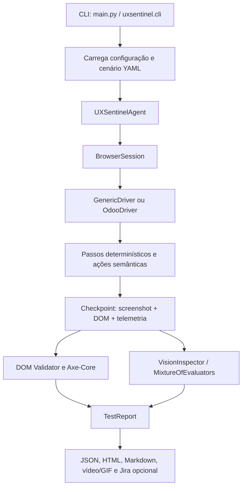

# Janela de Contexto do Projeto — UXSentinel

> Documento de entrada rápida para agentes e desenvolvedores. Reúne o contexto verificável na documentação e no código-fonte atual do UXSentinel. Quando houver divergência, o código executável e os testes têm precedência sobre descrições históricas.

## Identidade

O UXSentinel é um agente universal de QA visual, auditoria de UX, acessibilidade e regras de negócio para aplicações web. Ele combina automação Playwright, inspeção determinística do DOM, Axe-Core, telemetria do navegador e modelos multimodais de visão. O produto é neutro em relação ao framework da aplicação auditada; `generic` é o perfil padrão e `odoo` é um adaptador especializado.

Regras de produto que devem permanecer verdadeiras:

- Toda comunicação e saída voltada ao usuário deve priorizar português do Brasil.
- Os testes do projeto devem ser herméticos: sem rede real, credenciais de produção ou dependência de um sistema externo.
- O navegador pode operar visível para acompanhamento humano ou em modo headless para automação/CI.
- Credenciais, tokens e arquivos de configuração pessoal não devem ser gravados no repositório.
- Não alterar versão, criar release, tag ou publicar no PyPI sem testes aprovados e autorização explícita do usuário.

## Como a execução funciona



O caminho principal é:

1. A CLI resolve o cenário, o perfil, o provedor e as opções de execução.
2. `UXSentinelAgent.run_scenario()` resolve os valores efetivos e abre uma sessão Playwright.
3. O driver executa cada passo do YAML. Seletores que falham podem passar pelo `SelectorHealer`.
4. Um `checkpoint` captura a tela, compara baseline quando configurado, extrai DOM limpo, coleta telemetria e roda Axe-Core.
5. `ScreenInspector` avalia a evidência com um provedor LMM. Quando habilitado, o `MixtureOfEvaluators` executa especialistas em paralelo e consolida achados duplicados.
6. O agente fecha a sessão, finaliza vídeo/GIF, calcula totais e salva os relatórios configurados.

## Mapa do código-fonte

| Área | Responsabilidade | Ponto de entrada |
| --- | --- | --- |
| CLI | Argumentos, comandos auxiliares, resolução de cenário e overrides | [`uxsentinel/cli.py`](../uxsentinel/cli.py) |
| Orquestração | Ciclo completo de cenário, checkpoints, artefatos e Jira | [`uxsentinel/core/agent.py`](../uxsentinel/core/agent.py) |
| Configuração | Modelos Pydantic, carregamento e precedência de opções | [`uxsentinel/core/config.py`](../uxsentinel/core/config.py) |
| Domínio | `Scenario`, `StepAction`, `Issue`, `TestReport` e resultados | [`uxsentinel/core/models.py`](../uxsentinel/core/models.py) |
| Navegador | Sessão Playwright, ciclo de vida e viewport | [`uxsentinel/browser/session.py`](../uxsentinel/browser/session.py) |
| Drivers | Operações web comuns e adaptação por framework | [`uxsentinel/browser/drivers/`](../uxsentinel/browser/drivers/) |
| Autocura | Recuperação de seletores por acessibilidade ou visão | [`uxsentinel/browser/healing.py`](../uxsentinel/browser/healing.py) |
| Ações semânticas | `ai_click`, `ai_fill`, `ai_assert` e `ai_action` | [`uxsentinel/browser/semantic_actions.py`](../uxsentinel/browser/semantic_actions.py) |
| Diagnóstico | Console, falhas de rede e Navigation Timing W3C | [`uxsentinel/browser/telemetry.py`](../uxsentinel/browser/telemetry.py) |
| Acessibilidade | Execução Axe-Core e conversão em issues | [`uxsentinel/browser/axe_runner.py`](../uxsentinel/browser/axe_runner.py) |
| Cenários | Parser, validação e biblioteca de YAML | [`uxsentinel/scenarios/parser.py`](../uxsentinel/scenarios/parser.py) |
| Visão | Cliente multiprovedor, prompts e inspeção de screenshots | [`uxsentinel/vision/`](../uxsentinel/vision/) |
| Avaliadores | Linguist, Leakage, Layout, Domain e consolidação | [`uxsentinel/vision/evaluators/`](../uxsentinel/vision/evaluators/) |
| Relatórios | HTML, JSON, Markdown, prompts de correção e arquivamento | [`uxsentinel/reporter/`](../uxsentinel/reporter/) |
| Integrações | Sincronização opcional de inconformidades com Jira | [`uxsentinel/integrations/jira.py`](../uxsentinel/integrations/jira.py) |

## Contratos importantes

### Cenários YAML

O cenário declara `id`, `title`, `profile`, variáveis, passos e checkpoints. As ações determinísticas incluem `goto`, `click`, `fill`, `type`, `clear`, `select`, `press`, `hover`, `scroll`, esperas, validações de campos e `checkpoint`. As ações semânticas são `ai_click`, `ai_fill`, `ai_assert` e `ai_action`.

Um checkpoint deve declarar `expected_behavior` quando a regra de negócio ou o estado visual esperado não forem óbvios. Esse texto é enviado ao avaliador de domínio e orienta a classificação da tela.

Referências: [gramática de cenários](04_especificacao_cenarios_yaml.md) e [biblioteca de exemplos](../uxsentinel/scenarios/library/).

### Precedência de configuração

Para opções suportadas pelo agente, a ordem geral é:

1. Override explícito da CLI.
2. Campo equivalente no cenário YAML.
3. Configuração global carregada pelo `GlobalConfig`.
4. Fallback definido no código.

O provedor ativo pode ser selecionado pela CLI, pelo cenário ou pela configuração. O cliente unificado suporta serviços Anthropic, OpenAI/OpenAI-compatible, Gemini, Ollama, vLLM e gateways/SSO conforme o catálogo configurado. Antes da execução, o agente testa a conexão do provedor e pode tentar o fallback.

Configuração de projeto e exemplos: [`config/config.yaml`](../config/config.yaml) e [`config/config.example.yaml`](../config/config.example.yaml). Nunca inserir chaves reais nesses arquivos.

### Estratégia de inspeção

Cada checkpoint pode combinar:

- screenshot e texto limpo do DOM;
- validação matemática de overflow, truncamento e modais;
- Axe-Core com score e violações WCAG;
- baseline visual e imagem de diferença;
- logs de console, falhas HTTP e métricas W3C;
- avaliação LMM única ou quatro avaliadores especializados em paralelo;
- exceções declaradas no cenário para remover achados esperados.

As severidades são `bloqueante`, `alta`, `media` e `baixa`. Os avaliadores devem retornar JSON estruturado; o orquestrador desduplica achados, preserva a maior severidade e registra os avaliadores envolvidos.

## Artefatos de saída

O diretório de saída padrão é `scenarios/report` quando não houver outro diretório efetivo. Dependendo da configuração e das flags, a execução gera:

- relatório JSON estruturado;
- dashboard HTML autocontido;
- relatório Markdown para MarkText/Obsidian;
- screenshots de checkpoints e imagens de diff;
- baseline visual em `scenarios/baselines/<scenario_id>`;
- vídeo WebM/MP4 e GIF da sessão;
- prompt de correção;
- cards no Jira, somente quando a integração estiver habilitada.

Relatórios e capturas são evidências de execução e não devem ser confundidos com código-fonte ou configuração do produto.

## Desenvolvimento e verificação

O projeto exige Python 3.12+ e usa o ambiente local `ambiente/`. Comandos canônicos:

```bash
ambiente/bin/python3 -m pytest
ambiente/bin/ruff check .
ambiente/bin/ruff format --check .
```

Para uma mudança de implementação, adicionar ou ajustar testes em [`tests/`](../tests/) e executar primeiro o teste mais próximo do comportamento alterado. Antes de concluir, executar a suíte e os dois gates do Ruff. A instalação editável e o Chromium do Playwright seguem as instruções do [README](../README.md).

## Fontes e limites deste contexto

- Visão arquitetural e proposta: [01_visao_e_arquitetura.md](01_visao_e_arquitetura.md).
- Heurísticas e severidades: [02_heuristicas_de_inspecao.md](02_heuristicas_de_inspecao.md).
- Navegador, visão e telemetria: [03_agente_navegador_e_visao.md](03_agente_navegador_e_visao.md).
- Provedores e SSO: [05_configuracao_llm_e_provedores.md](05_configuracao_llm_e_provedores.md).
- Inventário e riscos documentados: [10_estado_atual_inventario_e_riscos.md](10_estado_atual_inventario_e_riscos.md).
- Regras operacionais obrigatórias: [`AGENTS.md`](../AGENTS.md) e [skill oficial](../.gemini/skills/uxsentinel-guide/SKILL.md).

`memory.md` é uma memória operacional útil, mas pode conter contagens e estados históricos. Para decidir comportamento atual, consultar nesta ordem: código executável, testes, configuração de exemplo, documentação técnica e memória histórica.