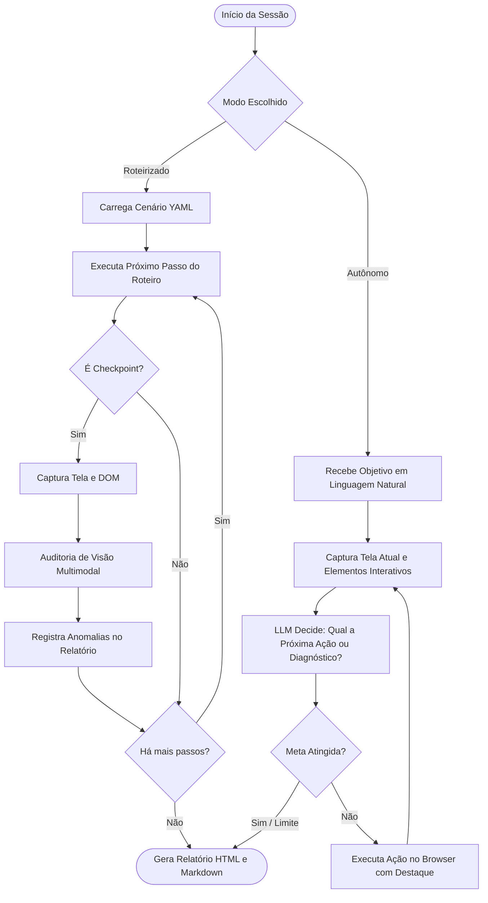

# Motor do Agente: Navegação Visual e Inspeção Cognitiva

Este documento detalha o funcionamento do **Agente Navegador** do UXSentinel, sua camada de automação gráfica com Playwright e o loop de raciocínio de visão computacional.

---

## 1. Experiência Visual do Operador (Human-in-the-Loop)

Ao rodar uma sessão de testes do UXSentinel, o objetivo é que o usuário acompanhe na sua própria tela a máquina navegando com elegância e clareza:

### 1.1 Janela Aberta e Resolução Realista
- O browser é iniciado com `headless: false`.
- Resolução de viewport configurável (padrão de **1440x900** ou **1920x1080**), evitando os modos responsivos minúsculos que mascaram quebras de desktop.

### 1.2 Ritmo Cadenciado (`slow_mo`)
- Injeção de atraso controlado (padrão de 350ms a 500ms) entre ações atômicas (mover cursor, focar, clicar, digitar).
- Elimina a velocidade instantânea e robótica típica de testes sintéticos, permitindo que os olhos humanos no ambiente de desenvolvimento ou demonstração entendam a transição de telas.

### 1.3 Marcador Visual de Ações (Visual Overlay Injected)
O agente injeta um microscript JavaScript no contexto do navegador que:
- Desenha um **cursor virtual animado** movendo-se até o elemento alvo.
- Adiciona uma **borda pulsante colorida** (ex: verde suave para clique, azul para preenchimento) sobre o elemento exato que está sendo acionado.
- Remove o destaque assim que a ação termina.

### 1.4 Inspeção ao Vivo com DevTools / Console Acoplado (`--devtools`)
- Quando a flag `--devtools` (ou `--console` / `--inspect`) é passada, o Chromium é iniciado com o painel de ferramentas de desenvolvedor (DevTools) aberto ao lado da página.
- Permite que o operador e desenvolvedores acompanhem em tempo real a aba **Console**, os erros emitidos pelo frontend, o tráfego da aba **Network** e a árvore de elementos.
- Ao mesmo tempo, o coletor de telemetria interno opera em segundo plano sem interferir na visualização.

---

## 2. Modos de Operação do Agente

### 2.1 Modo Roteirizado (Scripted Playbooks)
- Ideal para **testes de regressão frequentes** e proteção de regras de negócio estritas.
- O analista define uma sequência de ações (`goto`, `click`, `fill`, `wait`) e posiciona checkpoints de inspeção visual.
- A IA foca 100% da sua capacidade em auditar a cena contra os critérios exigidos no checkpoint.

### 2.2 Modo Autônomo Exploratório (Autonomous QA Agent)
- Ideal para **testes exploratórios**, validação de novidades e descoberta de cenários não previstos.
- O agente recebe um objetivo (ex: *"Acesse o formulário de cadastro de fornecedores, tente submeter o formulário sem preencher nada e verifique se as mensagens de validação estão em português e se os modais se comportam bem"*).
- A cada iteração:
  1. O agente captura o screenshot da tela e lista os elementos interativos disponíveis (botões, inputs, links).
  2. O modelo multimodal decide: *"Vou clicar no botão 'Salvar' para disparar a validação"*.
  3. O Playwright executa a ação visualmente.
  4. O agente observa a nova tela resultante, avalia a conformidade de UX e decide o próximo passo até atingir o objetivo ou o limite de iterações.

---

## 3. Estabilização e Tolerância a Assincronismo

Aplicações modernas sofrem com requisições assíncronas (AJAX, Fetch, WebSocket) e animações CSS. O UXSentinel conta com um mecanismo inteligente de auto-estabilização antes de qualquer captura:

1. **Network Idle Watcher**: Monitora se há requisições de rede pendentes nos últimos 500ms.
2. **Framework Hook**: Se um perfil de framework estiver ativo (ex: Odoo), aguarda que o indicador de loader (como `.o_loading`) desapareça.
3. **Animações Concluídas**: Aguarda o término de transições CSS e animações de modais (fade in/scale) para evitar capturas com elementos borrados ou fora de posição intermediária.

---

## 4. Telemetria de Console, Falhas de Rede e Performance W3C

O módulo `uxsentinel/browser/telemetry.py` injeta listeners assíncronos no ciclo de vida da `Page` do Playwright:

### 4.1 Coleta de Logs do Console da Aplicação
- **Console API**: Intercepta eventos `page.on("console")` capturando nível de severidade (`error`, `warning`, `info`, `debug`, `log`), mensagem e localização de script.
- **Page Errors**: Intercepta exceções não tratadas de JavaScript (`page.on("pageerror")`) registrando o stacktrace original.
- **Filtragem Inteligente**: Identifica erros críticos que afetam a experiência do usuário e os disponibiliza tanto no Dashboard HTML quanto no Relatório Markdown.

### 4.2 Monitoramento de Falhas de Rede (HTTP 4xx e 5xx)
- Intercepta `page.on("response")` registrando qualquer requisição concluída com código HTTP de erro (status $\ge 400$).
- Armazena URL, método (GET, POST, etc.), código HTTP e status text (ex: `404 Not Found`, `500 Internal Server Error`).

### 4.3 Medição de Performance com W3C Navigation Timing API
Ao final da navegação ou a cada checkpoint, o agente executa JavaScript determinístico para extrair métricas de `window.performance.getEntriesByType("navigation")[0]` ou `window.performance.timing`:
- **TTFB (Time to First Byte)**: Tempo até o primeiro byte de resposta do servidor (`responseStart - requestStart`).
- **DOM Interactive**: Momento em que o parsing do documento HTML é concluído e o DOM fica interativo (`domInteractive - responseStart`).
- **Page Load Time**: Tempo total de carregamento até o evento `loadEventEnd` (`loadEventEnd - navigationStart`).
- **Transfer Size**: Volume total de bytes transferidos pela rede para carregar a página principal.

Todas as métricas são consolidadas no modelo `PagePerformanceMetrics` e alimentam os relatórios gerados.

---

## 5. Ações Semânticas (IA) e Auto-Cura (Self-Healing)

Para além de seletores CSS tradicionais, o UXSentinel suporta ações declarativas cognitivas:
- **`ai_click`**: Localiza o elemento alvo descrevendo-o em linguagem natural (ex: `ai_click: "o botão azul de salvar"`), utilizando primeiro a árvore de acessibilidade da página (`page.accessibility.snapshot()`) e, se necessário, coordenadas visuais inferidas pelo modelo de visão.
- **`ai_fill`**: Preenche dados em campos identificados semanticamente.
- **`ai_assert`**: Validação cognitiva de alto nível avaliada diretamente pelo modelo de visão sobre o screenshot.
- **Self-Healing**: Quando um seletor tradicional falha com `TimeoutError`, o agente analisa a árvore de acessibilidade e a imagem para reencontrar o botão/campo e prosseguir com o teste sem quebra espúria.
