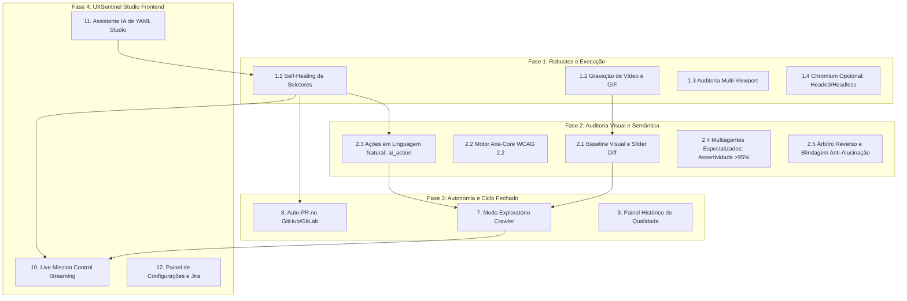
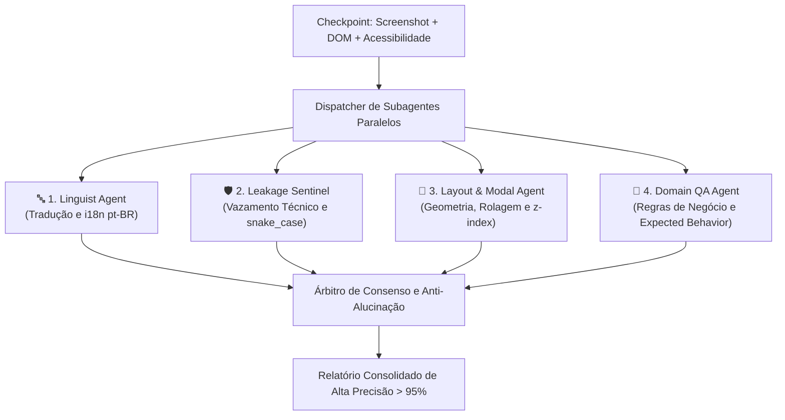
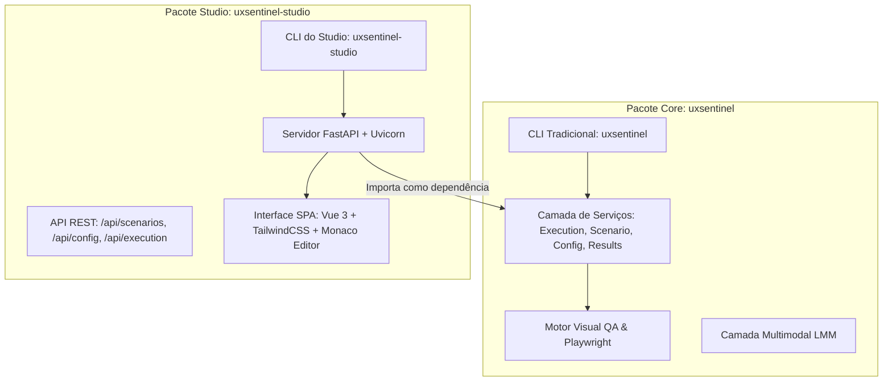

# Roadmap de Evolução e Especificação Técnica de Melhorias — UXSentinel

Este documento estabelece o **plano diretor de evolução técnica e funcional do UXSentinel**, consolidando as melhores práticas do mercado de automação de testes com Inteligência Artificial (inspiradas em ferramentas como *Midscene.js*, *ZeroStep*, *Applitools Eyes*, *Percy*, *Playwright Agents 2026* e *Octomind*) adaptadas para o propósito singular do UXSentinel: **auditoria visual humanizada, validação de regras de negócio em ERPs corporativos (ex: Odoo) e geração automatizada de remediações técnicas.**

---

## 🧭 Visão Geral das Fases de Evolução



---

## 🚀 Fase 1: Robustez e Eficiência de Execução

### 1.1 Self-Healing de Seletores com Visão e Árvore de Acessibilidade
* **Problema:** Em aplicações corporativas dinâmicas (como Odoo, React ou Vue), classes CSS e IDs de elementos sofrem alterações frequentes entre versões ou personalizações de clientes, quebrando testes tradicionais por `TimeoutError`.
* **Solução Proposta:** Quando uma ação (`click`, `fill`, `hover`) falhar por timeout no seletor CSS declarado, o motor não abortará o teste imediatamente. Em vez disso, entrará no modo **Auto-Cura (Self-Healing)**:
  1. Captura o screenshot atual da página e a árvore de acessibilidade simplificada (`page.accessibility.snapshot()`).
  2. Envia um prompt rápido para o modelo de visão com a imagem e a intenção do passo original (ex: *"Localize na interface o botão de confirmação de pedido que antes usava o seletor `button.btn-primary.o_sale_confirm`"*).
  3. A IA retorna as coordenadas visuais `(x, y)` e/ou o novo seletor mais robusto baseado em papéis de acessibilidade (ex: `role=button[name="Confirmar"]`).
  4. O driver executa o clique nas coordenadas e prossegue com o teste.
  5. Ao final, o relatório e o CLI exibem uma advertência com a sugestão de correção do YAML para que o desenvolvedor possa atualizar o arquivo de cenário.
* **Componentes a Modificar:**
  - `uxsentinel/browser/drivers/base_driver.py`: Encapsular as chamadas `click` e `fill` com tratamento de exceção e gatilho de cura.
  - `uxsentinel/vision/healer.py` *(novo)*: Módulo responsável por formular o prompt de cura e calcular pontos de clique.
  - `uxsentinel/core/models.py`: Registrar eventos de autocura no `TestReport` (`healed_steps: list[HealedStep]`).

---

### 1.2 Gravação Nativa de Vídeo e Geração de GIF da Sessão
* **Problema:** Em testes visuais complexos ou que falham intermitentemente, screenshots estáticos dos checkpoints mostram apenas o estado final, perdendo o momento exato em que uma animação travou ou um diálogo sumiu.
* **Solução Proposta:** Integrar a funcionalidade nativa de gravação de vídeo do Playwright:
  1. Ativação via configuração `browser.record_video: true` ou flag CLI `--video`.
  2. O Playwright grava o fluxo completo em formato `.webm`.
  3. No fechamento da sessão, o UXSentinel processa o vídeo e:
     - Gera uma versão MP4 compatível com todos os navegadores.
     - Gera opcionalmente um GIF leve e recortado dos 5 segundos anteriores a cada falha de checkpoint.
     - Incorpora o player de vídeo diretamente no topo do **Dashboard Visual HTML**.
     - Anexa o arquivo de vídeo/GIF ao card correspondente criado no **Atlassian Jira**.
* **Componentes a Modificar:**
  - `uxsentinel/browser/session.py`: Configurar `record_video_dir` e `record_video_size` no `BrowserContext`.
  - `uxsentinel/reporter/video_helper.py` *(novo)*: Utilitários para conversão e otimização de vídeo/GIF.
  - `uxsentinel/reporter/html_builder.py`: Injetar componente de vídeo HTML5 no relatório.
  - `uxsentinel/integrations/jira.py`: Suporte a upload de anexos via multipart na API do Jira.

---

### 1.3 Auditoria de Responsividade Multi-Viewport
* **Problema:** Um formulário ou modal pode renderizar com perfeição em um monitor Desktop (1440x900), mas quebrar totalmente em tablets ou smartphones (botões de ação escondidos abaixo da dobra, tabelas com overflow sem rolagem).
* **Solução Proposta:** Permitir que o mesmo cenário seja auditado em múltiplas dimensões de viewport na mesma execução:
  1. No arquivo de cenário YAML:
     ```yaml
     viewports:
       - name: desktop
         width: 1440
         height: 900
       - name: tablet
         width: 768
         height: 1024
       - name: mobile
         width: 375
         height: 812
     ```
  2. Na CLI: `uxsentinel -s scenario.yaml --viewports desktop,mobile`.
  3. O agente executa cada checkpoint redimensionando a viewport dinamicamente ou executando o fluxo em matriz, identificando falhas de layout específicas para mobile/tablet.
  4. O relatório HTML agrupa as inconformidades por resolução.

---

### 1.4 Controle Opcional e Flexível da Visualização no Chromium (Modos Headed / Headless / GUI)
* **Problema:** Por padrão, o UXSentinel foi projetado para abrir a janela do Chromium com acompanhamento visual humano ao vivo. Contudo, em fluxos de trabalho contínuos no dia a dia, a janela do navegador frequentemente "rouba o foco" do teclado enquanto o desenvolvedor está editando código no VS Code ou executando comandos no terminal. Além disso, em ambientes remotos (SSH sem display gráfico) ou quando o acompanhamento é feito pelo terminal ou pelo futuro *UXSentinel Studio*, o desenvolvedor deseja rodar o teste de forma silenciosa ou alternar entre modo visível e invisível sem atrito.
* **Solução Proposta:**
  1. **Suporte a Flags Simétricas e Semânticas na CLI:**
     - `--headless` / `--no-gui`: Força a execução sem janela gráfica (modo invisível, silencioso e rápido).
     - `--headed` / `--gui` / `--visible`: Força a abertura da janela do Chromium mesmo se o `config.yaml` definir `headless: true` como padrão.
  2. **Hierarquia de Precedência Configurável:**
     - **CLI (Maior precedência):** Flags `--headless` ou `--headed` sobrescrevem tudo.
     - **Cenário YAML (Média precedência):** Campo opcional no cenário:
       ```yaml
       id: teste_rapido_faturamento
       headless: true # Executa este teste específico em background
       ```
     - **Arquivo Global `config.yaml` (Base):** `browser.headless: false` (ou `true`, caso o desenvolvedor prefira trabalhar sempre em background por padrão).
  3. **Acompanhamento no Terminal Sem Janela Gráfica (Terminal Live Monitor):**
     - Quando a visualização do Chromium estiver desativada (`--headless`), o terminal mantém riqueza visual através da biblioteca `rich`:
       - Barra de progresso dos passos com spinner animado.
       - Mensagens em tempo real do que a IA está analisando em cada checkpoint.
       - Tabela final e geração de relatórios mantidas integralmente.
  4. **Modo Background / Sem Roubo de Foco (*Focus-Safe*):**
     - Parâmetros para abrir o Chromium minimizado ou em segundo plano no sistema operacional, permitindo que a janela exista sem interromper a digitação do desenvolvedor.
* **Componentes a Modificar:**
  - `uxsentinel/cli.py`: Adicionar as flags simétricas `--headed` / `--gui` / `--no-gui` e conectar à prioridade do parser.
  - `uxsentinel/core/models.py`: Suporte ao campo `headless: bool | None = None` no modelo `Scenario`.
  - `uxsentinel/core/agent.py`: Resolver precedência (`CLI > Cenário YAML > config.yaml`).

---

## 🎨 Fase 2: Auditoria Visual e Semântica Avançada

### 2.1 Baseline Visual com Slider Comparativo (Antes vs. Depois)
* **Problema:** Quando uma tela é aprovada pela auditoria, equipes querem garantir que futuras alterações visuais não introduzam regressões acidentais de layout (pixel shifts, margens quebradas).
* **Solução Proposta:** Implementar o padrão consagrado por ferramentas como *Applitools* e *Percy*:
  1. **Modo Baseline (`--update-baseline`):** Quando um teste passa e é homologado, os screenshots de cada checkpoint são salvos na pasta `scenarios/baselines/{scenario_id}/{checkpoint_name}.png`.
  2. **Modo Comparação:** Em execuções seguintes, o UXSentinel:
     - Compara o screenshot atual com o baseline.
     - Gera uma imagem de máscara de diferença (*diff highlight*) destacando em cor viva (magenta/vermelho) onde houve alteração de layout.
     - A IA analisa especificamente a região alterada para determinar se foi uma mudança intencional ou um defeito.
  3. **Visualizador Interativo no Relatório HTML:** Inclusão de um componente interativo com **slider deslizante "Antes / Depois"**, permitindo que o time arraste a barra para inspecionar alterações visuais sutis com facilidade.
* **Componentes a Criar:**
  - `uxsentinel/vision/diff.py`: Algoritmo leve de imagem (usando `Pillow`) para gerar mapa de diferenças visuais.
  - Atualização do template HTML em `uxsentinel/reporter/templates/report.html`.

---

### 2.2 Motor Axe-Core para Acessibilidade Rigorosa (WCAG 2.2)
* **Problema:** A visão por IA é excelente para ergonomia macro e contexto, mas cálculos matemáticos de contraste de cor (ex: proporção mínima de 4.5:1 exigida pela WCAG) e árvore de acessibilidade invisível (ex: atributos `aria-labelledby` ausentes) se beneficiam de validação analítica determinística.
* **Solução Proposta:** Integrar a biblioteca padrão mundial `axe-core`:
  1. No momento de executar o checkpoint, o Playwright injeta programaticamente o script `axe.min.js` na página.
  2. O script executa a varredura WCAG 2.2 em milissegundos e retorna um relatório JSON com violações de conformidade.
  3. O resultado do Axe é fornecido como contexto complementar no prompt do auditor de visão multimodal.
  4. Isso une o melhor de dois mundos: **precisão analítica de normas WCAG** com a **compreensão cognitiva e estética da IA**.

---

### 2.3 Ações Semânticas em Linguagem Natural (`ai_action`)
* **Problema:** Escrever seletores CSS rígidos para cada clique ou preenchimento de campo consome tempo dos analistas de QA e torna os arquivos YAML verbosos.
* **Solução Proposta:** Introduzir ações semânticas interpretadas em tempo de execução:
  ```yaml
  steps:
    - action: goto
      url: "https://meu-erp.com/vendas"

    - action: ai_click
      target: "o botão de criar nova cotação no cabeçalho"

    - action: ai_fill
      target: "campo de cliente"
      value: "Empresa XPTO Ltda"

    - action: ai_assert
      target: "verificar se o total do pedido foi calculado e está visível"
  ```
* O motor consulta a visão e a árvore semântica da tela para inferir o elemento correto sem necessidade de inspecionar o código-fonte manualmente.

---

### 2.4 Arquitetura Multiagente Especializada (Mixture of Evaluators para Assertividade > 95%)
* **Problema:** O "prompt monólito" (onde um único prompt de 60 linhas pede para a LLM avaliar simultaneamente i18n, vazamento técnico, alinhamento, geometria de modais, regras de negócio e contraste) sobrecarrega a janela de atenção do modelo (*attention dilution*), gerando alucinações e perda de detalhes sutis de interface.
* **Solução Proposta:** Substituir a chamada única de checkpoint por um **Comitê de Subagentes Especialistas** executados em paralelo com prompts curtos e estritamente delimitados:



1. **🔤 Subagente de Tradução e i18n (Linguist Agent):**
   - **Contexto Focado:** Dicionário de nós de texto extraídos do DOM + OCR da tela.
   - **Missão:** Detectar estritamente termos não traduzidos para Português do Brasil (ex: *"Save"*, *"Discard"*, *"Back"*, *"Close"*, *"Search..."*).
   - **Assertividade Esperada:** **> 98%**, pois sua atenção opera sem distrações estéticas ou de regras.
2. **🛡️ Subagente de Vazamento Técnico (Leakage Sentinel):**
   - **Contexto Focado:** Tokens e identificadores do DOM pré-filtrados com regex.
   - **Missão:** Localizar nomes de colunas de banco em `snake_case` (`date_order`, `user_id`), prefixos do Odoo Studio (`x_studio_`), nomes de models técnicos (`res.partner`) ou IDs numéricos brutos expostos sem máscara amigável.
3. **📐 Subagente de Geometria e Modais (Layout & Visual Agent):**
   - **Contexto Focado:** Imagem recortada da janela modal/diálogo + coordenadas dos botões de rodapé.
   - **Missão:** Avaliar se o diálogo está centralizado na viewport, se não há overflow com rolagem horizontal desnecessária, se os botões de confirmação estão visíveis sem rolagem forçada e se o backdrop escurecido cobre a tela de forma correta.
4. **💼 Subagente de Regras de Negócio (Domain QA Agent):**
   - **Contexto Focado:** Estritamente o `expected_behavior` declarado no YAML do checkpoint + histórico de valores inseridos nos passos anteriores.
   - **Missão:** Confrontar se a intenção do fluxo foi concretizada (ex: *"o pedido mudou para o status 'Confirmado' e o valor total calculou R$ 1.500,00"*).

---

### 2.5 Mecanismos Complementares de Alta Precisão (Zero Falsos Positivos)
Para garantir que a assertividade supere 95% de forma sustentável, a camada multiagente é suportada por 5 técnicas de blindagem:

1. **Pré-validação Determinística no Playwright (Zero IA para Cálculos Matemáticos):**
   - Não pergunte à IA se um modal tem rolagem horizontal; execute diretamente via JavaScript:
     ```python
     has_overflow = await page.evaluate("el => el.scrollWidth > el.clientWidth", modal_el)
     ```
   - O resultado numérico exato alimenta o prompt do subagente como evidência factual indiscutível.
2. **Smart Cropping (Foco de Zoom em Zonas Críticas):**
   - Em telas de alta resolução (1440x900 ou 1920x1080), enviar a tela inteira reduz a nitidez de modais pequenos. O agente recorta automaticamente a caixa delimitadora do modal ativo e envia uma imagem ampliada e nítida para a visão multimodal.
3. **Set-of-Marks (Marcações com Identificadores Visuais):**
   - O Playwright injeta marcadores numéricos discretos (`[1]`, `[2]`, `[3]`) sobre botões e campos interativos antes do screenshot. A IA referencia o elemento pelo número correspondente, eliminando erros de localização espacial.
4. **Árbitro de Verificação Reversa (Devil's Advocate / Self-Consistency):**
   - Para qualquer falha classificada como **Bloqueante** ou **Alta**, um subagente validador recebe apenas o recorte visual do elemento e a alegação:
     > *"O avaliador apontou que o botão possui o texto em inglês 'Submit'. Na imagem ampliada, o texto realmente é 'Submit' em inglês ou trata-se de um termo legítimo?"*
   - O problema só entra no relatório e no Jira se houver confirmação unânime, eliminando falsos positivos.
5. **Glossário e Allowlist de Domínio Corporativo (`i18n_allowlist`):**
   - Configuração de termos em inglês amplamente aceitos pelo vocabulário de negócios da empresa (ex: *"Status"*, *"Dashboard"*, *"E-mail"*, *"Lead"*, *"Workflow"*, *"Odoo"*, *"Stripe"*). O Linguist Agent ignora esses termos automaticamente.

---

## 🤖 Fase 3: Autonomia Completa e Ciclo Fechado

### 3.1 Modo Exploratório Autônomo (`uxsentinel --crawl`)
* **Problema:** Escrever cenários manuais para centenas de telas corporativas é um gargalo de tempo.
* **Solução Proposta:** Criar um modo autônomo onde o agente atua como um "usuário explorador":
  1. Comando: `uxsentinel --crawl https://meu-erp.com --max-depth 3 --profile odoo`.
  2. O agente faz login, descobre a barra de navegação/menus e inicia uma exploração em árvore:
     - Abre cada módulo e menu.
     - Detecta telas brancas, exceções HTTP 500 ou modais de erro não tratados.
     - Procura termos em inglês e vazamentos de campos de banco de dados (`snake_case`).
  3. **Geração Automática de Cenários:** Ao terminar o crawl, o agente exporta automaticamente arquivos YAML com os cenários dos fluxos descobertos para que possam ser re-executados em CI/CD.

---

### 3.2 Ciclo Fechado: Criação Automática de Pull Requests (`--create-pr`)
* **Problema:** Hoje o UXSentinel detecta as falhas, gera o prompt de correção (`--fix-prompt`) e abre os cards no Jira (`--jira`). No entanto, o desenvolvedor ainda precisa copiar o prompt e aplicá-lo em uma IDE ou agente.
* **Solução Proposta:** Fechar o ciclo de ponta a ponta:
  1. Comando: `uxsentinel -s scenario.yaml --create-pr`.
  2. Ao finalizar a execução e detectar falhas, o UXSentinel:
     - Cria um branch Git novo (ex: `fix/uxsentinel-audit-cenario1`).
     - Invoca um agente de código local (como Claude Code, Cursor CLI ou Aider) passando o conteúdo gerado por `build_fix_prompt()`.
     - O agente aplica as correções no código-fonte do projeto alvo.
     - O UXSentinel re-executa o teste de forma autônoma para comprovar que o problema foi sanado.
     - Faz o push do branch e abre um **Pull Request no GitHub/GitLab**, incluindo no corpo do PR:
       * Screenshots de antes e depois.
       * Link do card criado no Jira.
       * Checklist de critérios de aceitação cumpridos.

---

### 3.3 Painel Histórico de Qualidade e Tendências (UXSentinel Hub)
* **Problema:** Times corporativos precisam demonstrar aos gestores a evolução da qualidade ao longo das semanas e releases.
* **Solução Proposta:**
  - Armazenar o histórico de execuções em um banco leve local (SQLite) ou JSON consolidado em `.uxsentinel/history.db`.
  - Comando `uxsentinel --dashboard` abre um painel web local exibindo:
    - Tendência de problemas bloqueantes e altos ao longo dos sprints.
    - Tempo médio de resposta da aplicação por checkpoint.
    - Módulos mais estáveis versus módulos que mais sofrem regressões visuais.

---

## 🖥️ Fase 4: UXSentinel Studio (Aplicação Web Desacoplada)

O **UXSentinel Studio** é a aplicação web gráfica oficial do ecossistema UXSentinel, distribuída como um pacote PyPI independente (`uxsentinel-studio`) via monorepo governado por **UV Workspace**. Ele permite aos operadores (QA, desenvolvedores, designers e POs) criar, editar, validar cenários e consultar relatórios sem depender do terminal e sem escrever YAML manualmente.

> 📘 **Especificação de Design Completa:** Consulte [`docs/superpowers/specs/2026-09-22-uxsentinel-studio-design.md`](superpowers/specs/2026-09-22-uxsentinel-studio-design.md) para detalhes do contrato de API, segurança e UV workspace.



### 4.1 Módulo de Autoria e Edição de Cenários (Visual & YAML Dual-Mode)
* **Conceito:** Alternância fluida entre visualização em blocos semânticos arrastáveis (`goto`, `click`, `fill`, `checkpoint`) e editor de código Monaco com syntax highlighting e validação de schema em tempo real.
* **Funcionalidades da Tela:**
  1. **Editor Visual em Blocos:** Montagem intuitiva de passos com autocompletes de seletores e parâmetros.
  2. **Validação Estruturada em Linha:** Erros de sintaxe ou de campos obrigatórios apontam imediatamente o número do passo com erro.
  3. **Disparo Imediato:** Botão "Executar Agora" que delega a execução diretamente para o `ExecutionService` do core.
     - *"Passo 04: Inspecionando modal de desconto no Odoo..."*
     - *"Analisando conformidade de tradução (pt-BR)..."*
     - *"Verificando visibilidade dos botões de ação e z-index..."*
  3. **Visor de Falhas Imediatas:** Alertas destacados em vermelho assim que uma inconformidade bloqueante é detectada pela IA, com a miniatura da screenshot e o trecho de código/seletor apontado.
  4. **Suporte a Ambos os Modos:** Funciona tanto para o modo roteirizado (**YAML**) quanto para o modo autônomo exploratório (**Crawler**), exibindo o mapa de nós e páginas visitadas.

---

### 4.2 Assistente de IA para Criação e Edição de Cenários YAML (YAML Studio)
* **Conceito:** Eliminar a barreira de entrada da escrita manual de seletores CSS e estruturas YAML, democratizando a automação de testes para toda a equipe.
* **Funcionalidades da Tela:**
  1. **Criação Guiada em Linguagem Natural:** O usuário descreve em uma caixa de diálogo o teste que deseja:
     > *"Quero criar um cenário para testar a criação de um pedido de venda no Odoo. Deve acessar a tela de vendas, clicar em Novo, preencher o cliente 'Empresa Exemplo', adicionar uma linha de produto e verificar se a tela está 100% em português e sem campos snake_case."*
  2. **Geração Inteligente via LLM Ativa:** O assistente utiliza o próprio provedor de IA configurado no UXSentinel (Claude Pro SSO, Gemini SSO, OpenAI ou Ollama local) para gerar o YAML estruturado com passos e checkpoints pertinentes.
  3. **Editor Visual com Validação em Tempo Real:** Editor com realce de sintaxe (syntax highlighting), autocomplete de ações suportadas (`click`, `wait_modal`, `checkpoint`) e validação instantânea contra o schema Pydantic do UXSentinel.
  4. **Ação Rápida "Executar Agora":** Botão com um clique que salva o arquivo na pasta `scenarios/` e inicia imediatamente a execução no Mission Control.

---

### 4.3 Painel Central de Configurações e Conectividade
* **Conceito:** Permitir gerenciar todo o arquivo de configuração global (`~/.config/uxsentinel/config.yaml`) sem necessidade de editar manualmente linhas de texto.
* **Funcionalidades da Tela:**
  1. **Integração Jira com Teste de Conexão com 1 Clique:**
     - Campos para URL, e-mail, API Token/PAT e Chave do Projeto padrão.
     - Botão "Testar Conexão": valida instantaneamente as credenciais contra a API da Atlassian e exibe o nome do projeto validado.
  2. **Catálogo de Provedores de IA:**
     - Seletor visual do provedor ativo (`anthropic_cloud`, `claude_sso`, `gemini_sso`, `openai_cloud`, `ollama_local`).
     - Botões para iniciar fluxo SSO pelo navegador ou limpar tokens em cache.
  3. **Ajustes de Navegador:**
     - Alternar modo visível vs. invisível (`headless`).
     - Slider de delay humanizado (`slow_mo_ms` entre 100ms e 1000ms).
     - Seletor de resolução padrão da viewport.

---

### 4.4 Central de Resultados, Relatórios e Remediação
* **Funcionalidades da Tela:**
  1. **Biblioteca de Relatórios:** Listagem de todas as auditorias anteriores com data, duração, status de aprovação e contagem de falhas (bloqueantes, altas, médias, baixas).
  2. **Visualizador Integrado:** Abertura direta do Dashboard HTML com screenshots e logs.
  3. **Central de Ações de Remediação:**
     - Botão para copiar ou baixar o prompt de correção (`{scenario_id}_fix_prompt.md`).
     - Links diretos clicáveis para os cards abertos no Jira correspondentes a cada execução.

---

### 4.5 Arquitetura de Entrega (Zero Dependências Externas)
* **Execução sob Demanda:**
  - O frontend só roda quando solicitado: `uxsentinel ui` ou `uxsentinel --web` (porta padrão `:8080`).
  - A CLI tradicional e as esteiras de CI/CD continuam puras, sem carregar servidores web nem consumir memória adicional.
* **Empacotamento Embutido:**
  - O frontend SPA é compilado como um pacote de arquivos estáticos em `uxsentinel/ui/static/`.
  - Ao instalar via `pip install uxsentinel`, a interface web já vem inclusa de fábrica, sem que o usuário final precise ter Node.js ou npm instalados na máquina.
* **Tecnologia Backend:**
  - Servidor construído com `FastAPI` / `Starlette` e `uvicorn`, aproveitando a arquitetura assíncrona (`asyncio`) nativa do Playwright.

---

## 📊 Matriz de Priorização e Cronograma Sugerido

| Funcionalidade | Esforço Técnico | Impacto para o Usuário | Prioridade Recomendada |
| :--- | :---: | :---: | :---: |
| **1.1 Self-Healing de Seletores** | Médio | Altíssimo | **P1 (Imediata)** |
| **1.2 Gravação de Vídeo e GIF** | Baixo | Alto | **P1 (Imediata)** |
| **1.3 Auditoria Multi-Viewport** | Baixo | Alto | **P1 (Imediata)** |
| **1.4 Controle Opcional de Visualização (Headed/Headless)** | Baixo | Altíssimo | **P1 (Imediata)** |
| **2.4 Subagentes Especialistas (Mixture of Evaluators)** | Médio | Altíssimo | **P1 (Imediata)** |
| **2.5 Árbitro Reverso e Blindagem Anti-Alucinação** | Baixo | Altíssimo | **P1 (Imediata)** |
| **4.1 Frontend: Live Mission Control & Configuração** | Médio | Altíssimo | **P2 (Curto Prazo)** |
| **4.2 Frontend: Assistente IA de YAML Studio** | Médio | Altíssimo | **P2 (Curto Prazo)** |
| **2.1 Baseline Visual com Slider Diff** | Médio | Altíssimo | **P2 (Curto Prazo)** |
| **2.2 Motor Axe-Core WCAG 2.2** | Baixo | Alto | **P2 (Curto Prazo)** |
| **2.3 Ações em Linguagem Natural (`ai_action`)** | Médio | Alto | **P2 (Curto Prazo)** |
| **3.1 Modo Exploratório Crawler** | Alto | Altíssimo | **P3 (Médio Prazo)** |
| **3.2 Criação Automática de Pull Requests** | Médio | Altíssimo | **P3 (Médio Prazo)** |
| **3.3 Painel Histórico de Qualidade** | Médio | Médio | **P3 (Médio Prazo)** |

---

Este documento serve como referência oficial de engenharia para guiar os próximos ciclos de desenvolvimento e releases do **UXSentinel**.

