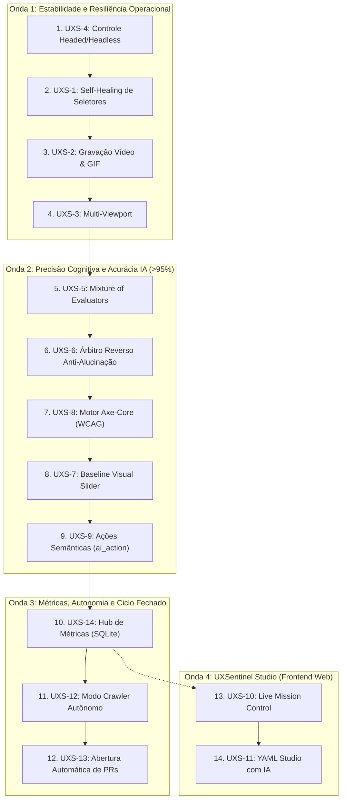

# 10. Estado Atual do Desenvolvimento, Inventário e Registro de Riscos

> **Data de Atualização:** 14 de Setembro de 2026  
> **Status do Repositório:** Estável / Produção v0.1.0+  
> **Ambiente de Testes:** 100% verde (`uv run pytest` — 12 testes aprovados)

Este documento foi concebido em atendimento às recomendações levantadas na [Análise da Memória Compactada (Doc 09)](09_analise_memoria_compactada.md). Seu objetivo é estabelecer um **retrato fiel, auditável e sem ambiguidades** do estado de engenharia do UXSentinel, distinguindo rigorosamente o que já está compilado e testado no código do que reside como planejamento nas Fases do Roadmap.

---

## 1. Mapeamento Fiel da Estrutura de Código

Abaixo está a arquitetura real implementada no pacote Python `uxsentinel/`:

```
uxsentinel/
├── __init__.py                  # Versão do pacote (__version__)
├── cli.py                       # CLI principal via argparse + Rich (interface de terminal)
├── assets/                      # Recursos visuais estáticos (logos e templates padrão)
├── browser/                     # Camada de automação de navegador via Playwright
│   ├── session.py               # BrowserSession (ciclo de vida, headless/headed, gravação de screenshots)
│   ├── visual_overlay.py        # Injeção JS de cursor simulado e halos visuais de clique
│   └── drivers/                 # Especialização por framework web
│       ├── base_driver.py       # BaseFrameworkDriver (contrato abstrato de estabilização)
│       ├── generic_driver.py    # GenericDriver (SPAs convencionais, React, Vue, Angular)
│       └── odoo_driver.py       # OdooDriver (tratamento de .o_loading, diálogos OWL e ActionManager)
├── core/                        # Núcleo de domínio e orquestração
│   ├── agent.py                 # UXSentinelAgent (execução de cenários, checkpoints e agregação)
│   ├── config.py                # Modelos Pydantic de configuração (~/.config/uxsentinel/config.yaml)
│   ├── models.py                # Entidades: Inconsistency, Checkpoint, ExecutionResult, Severity
│   └── sso.py                   # Autenticação interativa via browser e cache seguro de tokens SSO
├── integrations/                # Conectores com serviços corporativos
│   ├── __init__.py
│   └── jira.py                  # JiraClient (criação automática de issues via REST API Jira Cloud v3)
├── reporter/                    # Geração de saídas e artefatos de auditoria
│   ├── html_builder.py          # Relatório HTML interativo autocontido com anotações visuais
│   ├── json_builder.py          # Serialização estruturada dos resultados da inspeção
│   └── prompt_builder.py        # Geração de prompts Markdown prontos para correção por agentes LLM
├── scenarios/                   # Mecanismo de cenários declarativos
│   ├── parser.py                # Validação e parser de arquivos YAML de cenários
│   └── library/                 # Cenários pré-construídos para testes de sanidade
└── vision/                      # Inteligência visual multimodal (LMM)
    ├── client.py                # UnifiedVisionClient (OpenAI, Anthropic Claude, Google Gemini, Ollama, DeepSeek)
    ├── inspector.py             # VisionInspector (recorte de telas, OCR semântico e chamadas de visão)
    └── prompts.py               # Engenharia de prompts com Heurísticas de Nielsen, ISO 9241-11 e WCAG 2.2
```

---

## 2. Inventário de Funcionalidades: Concluído vs. Pendente

Para eliminar qualquer divergência entre o "estado desejado" e o "estado real", a tabela a seguir mapeia cada capacidade do produto, indicando seu status de implementação no código e a respectiva tarefa no Jira (quando aplicável):

| Funcionalidade | Componente Técnico | Status Real | Card Jira | Notas de Implementação |
| :--- | :--- | :---: | :---: | :--- |
| **Navegação com visual humano** | `uxsentinel.browser.session` | **Concluído** | `UXS-15` | Suporte a `slow_mo_ms`, cursor visual e highlights injetados na tela. |
| **Drivers Especializados de Framework** | `uxsentinel.browser.drivers` | **Concluído** | `UXS-16` | Estabilização DOM/rede, GenericDriver e OdooDriver (`.o_loading`, OWL dialogs). |
| **Execução de cenários YAML** | `uxsentinel.scenarios.parser` | **Concluído** | `UXS-17` | Ações `goto`, `click`, `fill`, `wait`, `checkpoint` totalmente operacionais. |
| **Integração Multiprovedor LMM** | `uxsentinel.vision.client` | **Concluído** | `UXS-18` | OpenAI (GPT-4o), Anthropic (Claude 3.5 Sonnet), Gemini 1.5, DeepSeek e Ollama local. |
| **Avaliação Cognitiva e Heurísticas** | `uxsentinel.vision.prompts` | **Concluído** | `UXS-19` | Inspeção visual com Heurísticas de Nielsen, ISO 9241-11 e WCAG 2.2 AA. |
| **Suporte a SSO de IA Corporativo** | `uxsentinel.core.sso` | **Concluído** | `UXS-20` | Login interativo no browser com `--login-sso` e persistência de sessão. |
| **Diagnóstico de Conectividade IA** | `uxsentinel.cli` | **Concluído** | `UXS-21` | Flag `--check-ai` com fallback automático de modelos e pre-flight check. |
| **Geração de Prompt de Correção** | `uxsentinel.reporter.prompt_builder` | **Concluído** | `UXS-22` | Flag `--fix-prompt` gera Markdown detalhado para agentes (Cursor, Claude Code). |
| **Abertura Automática de Cards no Jira** | `uxsentinel.integrations.jira` | **Concluído** | `UXS-23` | Flag `--jira` cria issues com severidade, steps e screenshots anexados. |
| **Configurador Interativo Jira CLI e XDG** | `uxsentinel.cli` / `core.config` | **Concluído** | `UXS-24` | Padrão XDG em `~/.config/uxsentinel/config.yaml` e `--set-jira-token` protegido. |
| **Suíte de Testes Hermética** | `tests/test_engine.py` | **Concluído** | `UXS-25` | 12/12 testes passando sem mocks frágeis ou dependências externas (`uv run pytest`). |
| **Self-Healing de Seletores** | `uxsentinel.browser.healing` | **Pronto Para Testar** | `UXS-1` | Autocura via acessibilidade e visão multimodal implementada (tests/test_self_healing.py). |
| **Gravação de Vídeo e GIF de Sessão** | `uxsentinel.reporter.video_helper` | **Pronto Para Testar** | `UXS-2` | Gravação Playwright, utilitário ffmpeg/Pillow, player HTML e anexo Jira (tests/test_video_recording.py). |
| **Auditoria Multi-Viewport** | `uxsentinel.core.agent` / `models` | **Pronto Para Testar** | `UXS-3` | Presets desktop/tablet/mobile, flags CLI, filtros HTML e anexo Jira (tests/test_multi_viewport.py). |
| **Controle Headed/Headless na CLI** | `uxsentinel.cli` | **Pronto Para Testar** | `UXS-4` | Flags simétricas, resolução hierárquica e Rich monitor implementados (tests/test_cli_display_mode.py). |
| **Arquitetura Mixture of Evaluators (>95%)** | `uxsentinel.vision.evaluators` | **Pronto Para Testar** | `UXS-5` | 4 agentes especializados em paralelo: Linguist, Leakage, Layout, Domain QA (tests/test_mixture_of_evaluators.py). |
| **Árbitro Reverso & Anti-Alucinação** | `uxsentinel.vision.arbiter` | **Pronto Para Testar** | `UXS-6` | Devil's Advocate, allowlist i18n, validação DOM e Set-of-Marks (tests/test_high_precision_mechanisms.py). |
| **Baseline Visual com Slider Antes/Depois**| `uxsentinel.vision.diff` / `reporter` | **Pronto Para Testar** | `UXS-7` | Regressão visual perceptual Pillow, slider interativo antes/depois e Jira diff (tests/test_visual_baseline.py). |
| **Motor Axe-Core Integrado** | `uxsentinel.browser.axe_runner` | **Pronto Para Testar** | `UXS-8` | Auditoria WCAG 2.2 local offline, A11y Score e relatórios HTML (tests/test_axe_core.py). |
| **Ações Semânticas `ai_action`** | `uxsentinel.scenarios` | *Pendente* | `UXS-9` | Passos no YAML em linguagem natural resolvidos por visão. Fase 2 (Prioridade: Medium). |
| **UXSentinel Studio (Live Mission Control)**| Novo módulo `studio/` | *Pendente* | `UXS-10` | Frontend Web com visualização e controle em tempo real. Fase 4 (Prioridade: High). |
| **YAML Studio com IA Assistente** | Novo módulo `studio/` | *Pendente* | `UXS-11` | Interface visual para criação e teste de YAMLs com IA. Fase 4 (Prioridade: Medium). |
| **Modo Exploratório Autônomo (`--crawl`)** | `uxsentinel.engine` | *Pendente* | `UXS-12` | Descoberta autônoma de fluxos e páginas. Fase 3 (Prioridade: Low). |
| **Auto-PR no GitHub (`--create-pr`)** | `uxsentinel.integrations` | *Pendente* | `UXS-13` | Abertura automática de PR com patch de correção de CSS/HTML. Fase 3 (Prioridade: Low). |
| **Painel Histórico de Qualidade (Hub)** | `uxsentinel.reporter` | *Pendente* | `UXS-14` | Banco local SQLite de tendências de regressão. Fase 3 (Prioridade: Low). |

---

## 3. Sequência Canônica de Implementação do Roadmap (4 Ondas / 14 Passos)

Para orientar os subagentes e a equipe de desenvolvimento, a implementação do roadmap segue 4 ondas ordenadas por dependência técnica e impacto no produto:



### 3.1 Sequenciamento Operacional Detalhado

| Ordem | Chave | Título da Tarefa | Onda | Prioridade | Complexidade | Justificativa de Engenharia |
| :---: | :--- | :--- | :---: | :---: | :---: | :--- |
| **1º** | **`UXS-4`** | **Controle Opcional Chromium (Headed/Headless)** | Onda 1 | **Highest** | Baixa | **Quick Win Imediato**: Formaliza flags complementares (`--headed`, `--no-gui`, `--gui`), destravando CI/CD e preparando base para as próximas tarefas. |
| **2º** | **`UXS-1`** | **Self-Healing de Seletores com Visão e A11y** | Onda 1 | **Highest** | Média-Alta | **Elimina Flakiness**: Auto-recuperação de seletores CSS quebrados via árvore de acessibilidade e visão multimodal. |
| **3º** | **`UXS-2`** | **Gravação Nativa de Vídeo e Geração de GIF** | Onda 1 | **High** | Média | **Observabilidade Visual**: Artefatos visuais automáticos no `BrowserSession` acoplados aos relatórios de erro do Self-Healing. |
| **4º** | **`UXS-3`** | **Auditoria de Responsividade Multi-Viewport** | Onda 1 | **High** | Média | **Fecha a Fase 1**: Execução paralela para Desktop (1920x1080), Tablet (768x1024) e Mobile (375x812). |
| **5º** | **`UXS-5`** | **Mixture of Evaluators (>95% Assertividade)** | Onda 2 | **Highest** | Alta | **Especialização de IA**: Subagentes especialistas em Layout, Conteúdo/i18n, Acessibilidade e Quebras Explícitas. |
| **6º** | **`UXS-6`** | **Árbitro Reverso & Blindagem Anti-Alucinação**| Onda 2 | **Highest** | Média-Alta | **Zero Falsos Positivos**: *Devil's Advocate* que valida os achados do `UXS-5` exigindo coordenadas reais e refutando alucinações. |
| **7º** | **`UXS-8`** | **Motor Axe-Core Integrado (WCAG 2.2)** | Onda 2 | **Medium** | Média | **Auditoria Determinística**: Injeção do `axe-core` no DOM para conformidade matemática aliada à visão de IA. |
| **8º** | **`UXS-7`** | **Baseline Visual com Slider Antes/Depois** | Onda 2 | **Medium** | Média | **Regressão Perceptual**: Comparador visual com slider interativo embutido no relatório HTML usando capturas multi-viewport. |
| **9º** | **`UXS-9`** | **Ações Semânticas em Linguagem Natural** | Onda 2 | **Medium** | Média | **Flexibilidade de Roteiro**: Passo `ai_action` no YAML para comandos semânticos interpretados por visão. |
| **10º**| **`UXS-14`**| **Painel Histórico de Qualidade (UXSentinel Hub)** | Onda 3 | **Low** | Média | **Persistência de Dados**: Banco local SQLite para histórico temporal, base de dados para o Crawler e Studio. |
| **11º**| **`UXS-12`**| **Modo Exploratório Autônomo (`--crawl`)** | Onda 3 | **Low** | Alta | **Autonomia Máxima**: Varrimento autônomo de sitemaps e links sem necessidade de roteiro YAML prévio. |
| **12º**| **`UXS-13`**| **Criação Automática de Pull Requests (`--create-pr`)**| Onda 3 | **Low** | Média | **Ciclo Fechado**: Abertura automática de PRs no GitHub com patches de correção sugeridos. |
| **13º**| **`UXS-10`**| **Frontend UXSentinel Studio (Live Mission Control)** | Onda 4 | **High** | Alta | **Interface Web em Tempo Real**: Dashboard FastAPI + Next.js com streaming WebSocket do navegador. |
| **14º**| **`UXS-11`**| **Assistente IA de Criação de YAML (YAML Studio)** | Onda 4 | **Medium** | Alta | **Experiência Visual Interativa**: Assistente conversacional para prototipagem e validação de cenários com IA. |

---

## 4. Matriz e Registro de Riscos (Técnicos e de Produto)

A gestão proativa de riscos assegura a estabilidade do agente em ambientes corporativos e esteiras de CI/CD:

| ID | Categoria | Descrição do Risco | Impacto | Probabilidade | Estratégia de Mitigação |
| :--- | :--- | :--- | :---: | :---: | :--- |
| **R-01** | **Técnico / IA** | **Alucinação do LMM:** Apontar problemas inexistentes ou ignorar defeitos evidentes em layouts complexos. | **Crítico** | Média | Implementar o *Mixture of Evaluators* (`UXS-5`) com *Árbitro Reverso* (`UXS-6`), exigindo evidência em coordenadas e validação por consenso. |
| **R-02** | **Operacional** | **Vazamento de Credenciais:** Persistência indevida de tokens do Jira ou chaves LLM em logs ou commits. | **Alto** | Baixa | Armazenamento restrito a `~/.config/uxsentinel/config.yaml` com permissão estrita `0600`, exclusão via `.gitignore` e suporte a variáveis de ambiente `${VAR}`. |
| **R-03** | **Performance** | **Custo e Latência de LMM:** Alto tempo de resposta e consumo excessivo de tokens durante inspeção de muitas telas. | **Alto** | Alta | Cache de screenshots não alterados (hashing de imagem), suporte a modelos locais (Ollama/vLLM) e execução seletiva de checkpoints. |
| **R-04** | **Automação** | **Flakiness em SPAs Dinâmicas:** Seletores quebram ou páginas demoram para hidratar (React, Vue, Odoo). | **Médio** | Média | Especialização de drivers (`OdooDriver` com checagem de `.o_loading`) e implementação do *Self-Healing* (`UXS-1`) guiado por acessibilidade e visão. |
| **R-05** | **Integração** | **Incompatibilidade de Versões do Playwright:** Diferença de binários do Chromium entre ambientes de desenvolvimento e CI Linux. | **Médio** | Baixa | Travamento de versões via `uv.lock` e Dockerfile hermético com instalação controlada de dependências de sistema (`playwright install --with-deps`). |

---

## 5. Registro de Decisões de Arquitetura (ADRs Implementadas e Descartadas)

### 5.1 Decisões Implementadas

1. **ADR-01: Configuração Global em Diretório XDG do Usuário (`~/.config/uxsentinel/`)**
   - *Contexto:* Inicialmente, configurações ficavam restritas ao diretório do projeto ou exigiam permissão de escrita local.
   - *Decisão:* Adotar `~/.config/uxsentinel/config.yaml` com fallback para variáveis de ambiente e arquivos locais.
   - *Consequência:* Usuários podem rodar o UXSentinel em qualquer repositório sem necessidade de reconfigurar chaves ou exigir privilégios `sudo`.

2. **ADR-02: Isolamento Hermético dos Testes Automatizados**
   - *Contexto:* Testes de engine falhavam se o desenvolvedor tivesse uma sessão expirada de Claude Code salva no sistema operacional.
   - *Decisão:* Isolar totalmente a busca de credenciais em `tests/test_engine.py` através de *mocking* seguro no nível da chamada de configuração.
   - *Consequência:* Execução reproduzível com 100% de sucesso em qualquer máquina (`uv run pytest`), viabilizando esteiras de CI sem falsos negativos.

3. **ADR-03: Conexão REST Nativa com Atlassian Jira Cloud**
   - *Contexto:* Necessidade de transformar achados de inspeção visual em ações concretas no fluxo do time de engenharia.
   - *Decisão:* Implementar cliente REST nativo (`JiraClient`) com autenticação via Basic Auth (e-mail + API Token), payload estruturado em Atlassian Document Format (ADF) e suporte a anexo de screenshots.
   - *Consequência:* Automação ponta a ponta: inspeção visual $\rightarrow$ geração de issue categorizada no Jira com severidade mapeada.

### 5.2 Decisões Descartadas / Rejeitadas

1. **DESC-01: Dependência Exclusiva de Modelos Proprietários em Nuvem (OpenAI / Anthropic)**
   - *Motivo do Descarte:* Empresas com requisitos rígidos de conformidade (LGPD, sigilo bancário) não podem enviar screenshots de sistemas internos para APIs externas.
   - *Alternativa Adotada:* Arquitetura agnóstica via `UnifiedVisionClient`, permitindo uso de modelos locais (Ollama, vLLM) e gateways privados corporativos com autenticação SSO.

2. **DESC-02: Interface Baseada Apenas em Headless Silencioso**
   - *Motivo do Descarte:* Ferramentas tradicionais de QA falham em gerar confiança no time porque os testes rodam em "caixas pretas" sem rastreabilidade visual do que o robô está fazendo.
   - *Alternativa Adotada:* Modo visual humano como cidadão de primeira classe (`headless=False`, `slow_mo`, cursor animado e anotações na tela), tornando o modo `headless` uma opção para esteiras headless de CI/CD.

3. **DESC-03: Execução de Inspeção por Heurística em Única Chamada LLM Genérica**
   - *Motivo do Descarte:* Apresentou taxa de assertividade inferior a 70% em testes empíricos de mercado, gerando falsos positivos sobre cores e textos contextuais.
   - *Alternativa Adotada:* Planejamento do *Mixture of Evaluators* (`UXS-5`), onde subagentes independentes avaliam eixos isolados e um árbitro reverso filtra inconsistências.
