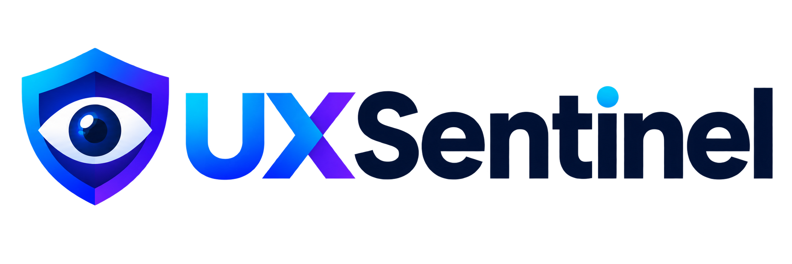

  

# Documentação Técnica e de Contexto — UXSentinel

Bem-vindo à central de documentação e engenharia do **UXSentinel**, o agente inteligente universal de QA visual, inspeção de UX e validação de regras de negócio para aplicações web (Odoo, React, Vue, Angular, Django, SaaS e portais corporativos).

---

## 📚 Índice da Documentação

Os documentos abaixo fornecem o embasamento teórico, técnico e operacional do projeto:

1. **[01. Visão Geral e Arquitetura Universal](01_visao_e_arquitetura.md)**  
   Conheça a proposta de valor, a arquitetura em camadas, a neutralidade de frameworks e a orquestração entre Playwright (Navegador com acompanhamento visual ao vivo), Visão Computacional e Motores de Relatório.

2. **[02. Heurísticas Universais de Inspeção de QA e UX](02_heuristicas_de_inspecao.md)**  
   Catálogo completo de heurísticas de auditoria visual: internacionalização (i18n), prevenção de vazamento de jargões técnicos e nomes de banco (`snake_case`), ergonomia e geometria de modais, integridade de regras de negócio e matriz de severidade (Bloqueante, Alta, Média, Baixa).

3. **[03. Motor do Agente: Navegação Visual e Inspeção Cognitiva](03_agente_navegador_e_visao.md)**  
   Como o agente opera em modo visual humano (`headless=False`, `slow_mo`, cursor animado e highlights de clique na tela), as diferenças entre o Modo Roteirizado (YAML) e o Modo Autônomo Exploratório, e os mecanismos de auto-estabilização de tela.

4. **[04. Especificação Declarativa de Cenários (YAML)](04_especificacao_cenarios_yaml.md)**  
   Manual e gramática para escrita de cenários e fluxos de teste em arquivos YAML, dicionário de ações suportadas (`goto`, `click`, `fill`, `wait_modal`, etc.) e definição de checkpoints com regras de negócio em português.

5. **[05. Configuração Unificada de Modelos de Linguagem e Visão (LLMs)](05_configuracao_llm_e_provedores.md)**  
   Arquitetura de conexão agnóstica para inteligência artificial via `config/config.yaml`. Suporte aos três pilares: **APIs Cloud** (Anthropic Claude, OpenAI GPT-4o, Google Gemini), **Modelos Locais** (Ollama, vLLM, Qwen2-VL) e **Gateways Corporativos / SSO** com tokens e cabeçalhos customizados.

6. **[06. Perfis e Plugins de Frameworks](06_plugins_e_perfis_frameworks.md)**  
   Como a arquitetura extensível adapta o agente a ecossistemas específicos: perfil universal `generic`, perfil especializado `odoo` (tratamento de `.o_loading`, diálogos OWL e ActionManager) e perfis para SPAs modernas.

7. **[07. Guia de Criação de Releases e Publicação no PyPI](07_guia_de_publicacao_e_releases.md)**  
   Procedimento passo a passo para criar novas releases no GitHub (via CLI `gh` ou interface web) e acionar a esteira de CI/CD automatizada com validação e deploy no PyPI.

8. **[08. Roadmap de Melhorias e Evolução Técnica](08_roadmap_melhorias_e_evolucao.md)**  
   Plano diretor de evolução inspirado nas melhores ferramentas de QA com IA do mercado (Midscene, ZeroStep, Applitools, Playwright Agents e Octomind): *Self-Healing* de seletores, gravação de vídeos/GIFs, auditoria multi-viewport, controle flexível de visualização do Chromium, **arquitetura de subagentes especialistas com árbitro reverso para assertividade acima de 95%**, baseline visual com slider antes/depois, motor Axe-Core WCAG 2.2, modo crawler exploratório, abertura de Pull Requests e **Frontend Opcional (UXSentinel Studio & Live Mission Control)** com assistente IA para criação de cenários YAML.

9. **[09. Análise da Memória Compactada do Projeto](09_analise_memoria_compactada.md)**  
   Revisão crítica do arquivo de memória do projeto, com foco em identidade, arquitetura, roadmap, pontos fortes, observações e recomendações para manter a documentação alinhada com a implementação.

10. **[10. Estado Atual do Desenvolvimento, Inventário e Registro de Riscos](10_estado_atual_inventario_e_riscos.md)**  
    Retrato fiel e operacional do código: mapeamento exato dos pacotes Python, inventário de funcionalidades concluídas vs. pendentes vinculado aos cards do Jira (`UXS-1` a `UXS-14`), matriz de riscos técnicos/produto e registro de decisões de arquitetura (ADRs) implementadas e descartadas.

---

## 🎯 Pilares Estratégicos do UXSentinel

- **Acompanhamento Visual ao Vivo**: O agente navega com o navegador visível na tela e velocidade humanizada, permitindo que a equipe audite visualmente a execução.
- **Universalidade Real**: Funciona com qualquer interface web, com adaptadores opcionais para frameworks complexos.
- **Liberdade de Provedores de IA**: Alternância fluida entre APIs proprietárias na nuvem, inferência 100% local com Ollama ou gateways corporativos com SSO.
- **Decisões Baseadas em Regras de Negócio**: Não é apenas um detector de quebras de layout, mas um validador cognitivo que confronta a tela com o que foi especificado para o fluxo.
