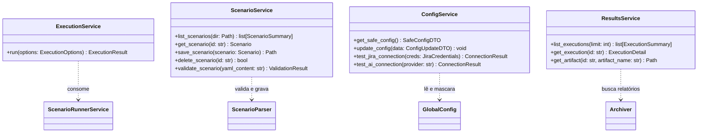

# Especificação de Design: UXSentinel Studio & Arquitetura de Pacotes Desacoplados

- **Data:** 2026-09-22
- **Status:** ✅ Planejamento Concluído — Pronto para Execução
- **Origem:** Cards Jira `UXS-30` (Guarda-chuva), `UXS-31` a `UXS-35`, `UXS-11` (YAML Studio) e `UXS-14` (Hub)
- **Decisão Arquitetural Principal:** Separação física em **dois pacotes independentes no PyPI**: `uxsentinel` (Core + CLI) e `uxsentinel-studio` (Web Application & SPA).
- **Layout Aprovado:** Estilo A — 3 Colunas (Sidebar Esq. · Editor Central · Inspetor Dir.)
- **Decisões de UI Aprovadas:**
  - Streaming: **SSE** (Server-Sent Events)
  - Escopo V1: **Editor YAML + Live Preview** (Construtor Visual drag & drop → V2)
  - Salvamento: **Autosave** (debounce 1s) **+ CTRL+S** simultâneos
- **Autor:** Pair Programming AI & Tech Lead

---

## 1. Visão Geral e Modelo de Pacotes

Para garantir a máxima leveza em esteiras de integração contínua (CI/CD) e servidores headless, o ecossistema é oficialmente particionado em dois pacotes Python independentes:

```mermaid
flowchart TD
    subgraph Pacote 1: uxsentinel (PyPI: uxsentinel)
        Core[Motor Visual QA & Automação Playwright]
        Vision[Camada Multimodal LMM: OpenAI, Claude, Gemini, Ollama]
        Services[Camada de Serviços Python Pura: Execution, Scenario, Config, Results]
        CLI[CLI do Agente: uxsentinel --scenario ...]
    end

    subgraph Pacote 2: uxsentinel-studio (PyPI: uxsentinel-studio)
        FastAPI[Servidor HTTP FastAPI + Uvicorn]
        REST[API REST: /api/scenarios, /api/config, /api/execution]
        SPA[Interface SPA Autocontida: Vue 3 + TailwindCSS + Monaco]
        StudioCLI[CLI do Studio: uxsentinel-studio]
    end

    CLI --> Services
    StudioCLI --> FastAPI
    FastAPI --> SPA
    FastAPI -->|Importa como dependência| Services
    Services --> Core
```

### 📦 Pacote 1: `uxsentinel` (Motor de Automação, LMM e CLI)
- **Missão:** Agente universal autônomo de Visual QA, WCAG 2.2 AA (Axe-Core), inspeção de heurísticas e relatórios.
- **Público:** CI/CD, pipelines automatizados, desenvolvedores de terminal e contêineres Docker mínimos.
- **Dependências:** Estritamente as 8 dependências de runtime essenciais (`playwright`, `pydantic`, `rich`, `pillow`, `jinja2`, `pyyaml`, etc.). **Zero dependências web como FastAPI ou Uvicorn.**
- **Comando de Entrada:** `uxsentinel`

### 🎨 Pacote 2: `uxsentinel-studio` (Interface Gráfica Web & Gestão)
- **Missão:** Central de controle visual local para autoria de cenários sem escrever YAML manualmente, gestão de credenciais e exploração interativa de relatórios.
- **Público:** Analistas de QA, Designers, Product Owners e Engenheiros que desejam experiência visual e assistente de IA.
- **Dependência de Plataforma:** Declara no `pyproject.toml` a dependência canônica:
  ```toml
  dependencies = [
      "uxsentinel>=1.1.7",
      "fastapi>=0.115.0",
      "uvicorn>=0.30.0",
  ]
  ```
- **Comando de Entrada:** `uxsentinel-studio`

---

## 2. Resolução Formal do Card UXS-35 (ADR do Studio)

Esta seção formaliza as decisões de arquitetura aprovadas para o card **[`UXS-35`](https://mygotryx.atlassian.net/browse/UXS-35)**:

### 2.1 Decisão 1: Separação de Pacotes e Servidor HTTP
* **Decisão:** Pacote separado `uxsentinel-studio` construído com **FastAPI + Uvicorn**.
* **Justificativa:** 
  - Elimina completamente o impacto de dependências web na instalação do `uxsentinel` básico utilizado em pipelines de CI/CD.
  - O ciclo de vida de releases de frontend (melhorias visuais, temas, layout) pode evoluir sem forçar releases constantes do motor de testes de QA.

### 2.2 Decisão 2: Segurança e Isolamento Local
* **Decisão:** O servidor faz bind **estritamente em `127.0.0.1`** e exige **Token de Sessão Efêmero** (`X-Studio-Token`).
* **Justificativa:**
  - Impede qualquer exposição acidental de credenciais em redes locais compartilhadas.
  - Ao executar `uxsentinel-studio`, um UUID criptográfico é gerado na memória do processo e injetado na URL que abre automaticamente o navegador do usuário (`http://127.0.0.1:8765/?token=...`).
  - Todas as chamadas na API REST validam o cabeçalho `X-Studio-Token`.

### 2.3 Decisão 3: Tecnologia do Frontend
* **Decisão:** **Single Page Application (SPA)** desenvolvida em **Vue 3 + TailwindCSS + Vite**, compilada estaticamente para HTML, CSS e JS puros embutidos em `uxsentinel_studio/static/`.
* **Justificativa:**
  - O usuário final não necessita de Node.js instalado na máquina; a instalação via `pip install uxsentinel-studio` já entrega os artefatos prontos servidos pelo FastAPI.
  - Componentização reativa para blocos arrastáveis de passos e integração nativa com o **Monaco Editor / CodeMirror 6** para sintaxe YAML com validação instantânea.

### 2.4 Decisão 4: Comandos de Entrada da CLI
* **Decisão:** Dois comandos claros e não conflitantes:
  - No pacote base: `uxsentinel --scenario <arquivo>`
  - No pacote studio: `uxsentinel-studio [--port 8765] [--no-browser]`
  - *Dica amigável no core:* Caso o usuário digite `uxsentinel studio` sem o pacote instalado, a CLI informa: `O UXSentinel Studio é instalado separadamente: pip install uxsentinel-studio`.

### 2.5 Decisão 5: Empacotamento e Manifesto
* **Decisão:** O pacote `uxsentinel-studio` declara seus próprios metadados PEP 517/621:
  - `MANIFEST.in`: `recursive-include uxsentinel_studio/static *`
  - `pyproject.toml`: `[tool.setuptools.package-data] "uxsentinel_studio" = ["static/**/*"]`

---

## 3. Arquitetura dos Serviços de Suporte (Camada `uxsentinel/service/`)

O pacote base `uxsentinel` fornece a camada de serviços reutilizáveis que atende tanto à CLI quanto ao Studio:



### 3.1 `ExecutionService` (UXS-31)
- Recebe o modelo `ExecutionOptions` sem depender de `argparse`.
- Aplica a resolução hierárquica de flags (CLI/API > YAML > Config XDG > Defaults).
- Dispara a execução via `ScenarioRunnerService` e retorna o `ExecutionResult` com relatório e exit code.

### 3.2 `ScenarioService` (UXS-32)
- CRUD de cenários YAML mantendo comentários e estrutura original.
- Trava de segurança contra Directory Traversal (`../../etc/passwd`).
- Validação estruturada detalhando o passo e campo problemático.

### 3.3 `ConfigService` (UXS-33)
- Leitura segura com mascaramento de chaves e segredos (`configured: true`).
- Gravação com permissões restritas `0600` no arquivo `~/.config/uxsentinel/config.yaml`.
- Métodos de teste de conectividade rápida para Jira e IA.

### 3.4 `ResultsService` (UXS-34) e `HubService` (UXS-14)
- Consulta unificada aos relatórios ativos em `report/`, compactados em ZIP e no banco SQLite `history.db`.

---

## 4. Contrato da API REST do Studio (`uxsentinel_studio/api.py`)

Todos os endpoints rodam localmente em `127.0.0.1` e exigem o cabeçalho `X-Studio-Token`:

| Método | Endpoint | Responsabilidade | DTO Entrada / Saída |
| :--- | :--- | :--- | :--- |
| `GET` | `/api/status` | Heartbeat e validação do token | `{ status: "ok", core_version: "1.1.7", studio_version: "1.0.0" }` |
| `GET` | `/api/scenarios` | Lista cenários locais e da biblioteca | `list[ScenarioSummaryDTO]` |
| `GET` | `/api/scenarios/{id}` | Recupera conteúdo estruturado e raw YAML | `{ id, metadata, steps, raw_yaml }` |
| `POST` | `/api/scenarios` | Salva novo cenário com validação | `ScenarioDTO` $\to$ `{ success, path }` |
| `PUT` | `/api/scenarios/{id}` | Atualiza cenário existente | `ScenarioDTO` $\to$ `{ success, path }` |
| `DELETE` | `/api/scenarios/{id}` | Exclui cenário local | `{ success: bool }` |
| `POST` | `/api/scenarios/validate` | Valida YAML sem persistir | `{ valid: bool, errors: list[StepError] }` |
| `POST` | `/api/execution/run` | Inicia auditoria em background | `{ scenario_id, overrides }` $\to$ `{ run_id }` |
| `GET` | `/api/execution/{run_id}` | Consulta status de execução | `{ status, current_step, logs }` |
| `GET` | `/api/config` | Configuração segura com tokens mascarados | `SafeConfigDTO` |
| `POST` | `/api/config` | Gravação de configurações (`0600`) | `ConfigUpdateDTO` |
| `POST` | `/api/config/test-jira` | Testa credenciais do Jira em 1 clique | `{ valid: bool, message: str }` |
| `POST` | `/api/config/test-ai` | Testa conectividade da IA ativa | `{ valid: bool, message: str }` |
| `GET` | `/api/results` | Histórico de auditorias anteriores | `list[ExecutionSummaryDTO]` |
| `GET` | `/api/results/{id}` | Detalhes e métricas da auditoria | `ExecutionDetailDTO` |
| `POST` | `/api/generate-scenario` | Assistente IA de autoria (YAML Studio) | `{ prompt: str }` $\to$ `{ yaml_content: str }` |

---

## 5. Estrutura de Diretórios e UV Workspace (Opção 1)

O repositório opera como um monorepo governado pelo **UV Workspace**, mantendo a raiz como pacote core e `studio/` como subprojeto:

```
UXSentinel/
├── docs/                                 # Documentação técnica e especificações
│   └── superpowers/specs/                # Specs arquiteturais (design docs)
├── scenarios/                            # Cenários YAML de exemplo
├── tests/                                # Testes herméticos do core (236 testes)
├── uxsentinel/                           # PACOTE 1: uxsentinel (PyPI Core)
│   ├── browser/                          # Playwright, ações, overlays, telemetria
│   ├── core/                             # Modelos Pydantic, config XDG, runner
│   ├── css/                              # Auditoria e inspector de CSS
│   ├── reporter/                         # Geradores HTML, Markdown, JSON, ZIP
│   ├── scenarios/                        # Parser seguro e biblioteca YAML
│   ├── service/                          # Camada de serviços desacoplada (UXS-31..34)
│   ├── vision/                           # Visão multimodal, árbitro e Mixture of Evaluators
│   └── cli.py                            # CLI tradicional (uxsentinel ...)
├── studio/                               # PACOTE 2: uxsentinel-studio (PyPI Studio)
│   ├── uxsentinel_studio/
│   │   ├── api.py                        # Endpoints REST FastAPI
│   │   ├── server.py                     # Inicializador do Uvicorn e token
│   │   ├── cli.py                        # Comando uxsentinel-studio
│   │   └── static/                       # SPA compilada (HTML, JS, CSS)
│   ├── frontend/                         # Código fonte Vue 3 + Tailwind + Vite
│   ├── pyproject.toml                    # Metadados próprios do uxsentinel-studio
│   └── tests/                            # Testes de integração da API do Studio
├── pyproject.toml                        # Metadados do pacote core uxsentinel + declaração do workspace
└── uv.lock
```

### Configuração do Workspace no `pyproject.toml` da Raiz:
```toml
[tool.uv.workspace]
members = [".", "studio"]
```

### Configuração de Dependência Local em `studio/pyproject.toml`:
```toml
[project]
name = "uxsentinel-studio"
version = "1.0.0"
dependencies = [
    "uxsentinel>=1.1.7",
    "fastapi>=0.115.0",
    "uvicorn>=0.30.0",
]

[tool.uv.sources]
uxsentinel = { workspace = true }
```

---

## 6. Plano de Verificação e Quality Gates

1. **Testes do Core (`uxsentinel`):**
   - 100% dos 236 testes herméticos existentes continuam passando via `ambiente/bin/pytest`.
   - Novos testes em `tests/test_execution_service.py`, `tests/test_scenario_service.py` e `tests/test_config_service.py`.
2. **Testes do Studio (`uxsentinel-studio`):**
   - Testes de API HTTP com `TestClient` (FastAPI) em `studio/tests/test_api.py`.
   - Teste de rejeição de requisições sem token de sessão (401 Unauthorized).
   - Teste de bloqueio de Directory Traversal em cenários e artefatos.
3. **Tríade de Qualidade:**
   ```bash
   ambiente/bin/pytest
   ambiente/bin/ruff check .
   ambiente/bin/ruff format --check .
   ```
