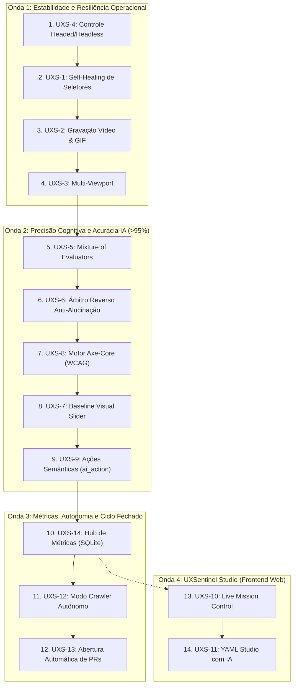

# 🧠 UXSentinel — Memória Compactada e Operacional do Projeto

> **Status do Repositório:** Ativo & Estável | **Última Atualização:** 14 de Setembro de 2026  
> **Versão Corrente:** v0.1.0+ | **Testes:** 100% Verde (`uv run pytest` — 108 testes aprovados)

---

## 📌 1. Visão Geral e Identidade do Produto

O **UXSentinel** é um agente inteligente universal de **Visual Quality Assurance (Visual QA)**, inspeção de usabilidade e validação de regras de negócio para aplicações web (SPAs, Odoo, React, Vue, Angular, Django, SaaS e portais corporativos).
O agente combina automação Playwright com **Modelos de Linguagem e Visão Multimodal (LMM)** (OpenAI, Anthropic Claude, Google Gemini, Ollama e DeepSeek) para atuar como um **avaliador cognitivo de interfaces digitais** baseado em:
- As 10 Heurísticas de Jakob Nielsen
- ISO 9241-11 (Eficácia, Eficiência e Satisfação da Experiência)
- Critérios de Acessibilidade WCAG 2.2 Nível AA

---

## 🏗️ 2. Arquitetura do Sistema e Estrutura Real do Código

```
UXSentinel/
├── .gemini/
│   └── skills/                  # Skills especializadas para subagentes
│       ├── uxsentinel-guide/    # Guia operacional geral do projeto
│       └── uxsentinel-senior-dev/# Skill de Dev Sênior Python 3.12+ para desenvolvimento
├── config/                      # Configurações padrão e templates (config.yaml)
├── docs/                        # Documentação técnica completa (01 a 10)
│   ├── 01_visao_e_arquitetura.md
│   ├── 02_heuristicas_de_inspecao.md
│   ├── 03_agente_navegador_e_visao.md
│   ├── 04_especificacao_cenarios_yaml.md
│   ├── 05_configuracao_llm_e_provedores.md
│   ├── 06_plugins_e_perfis_frameworks.md
│   ├── 07_guia_de_publicacao_e_releases.md
│   ├── 08_roadmap_melhorias_e_evolucao.md
│   ├── 09_analise_memoria_compactada.md
│   ├── 10_estado_atual_inventario_e_riscos.md
│   └── README.md
├── scenarios/                   # Cenários de teste guiados (YAML)
├── tests/                       # Suíte de testes automatizados (22 testes herméticos)
│   ├── test_engine.py
│   └── test_self_healing.py
├── uxsentinel/                  # Código-fonte Python principal
│   ├── __init__.py              # Versão do pacote (__version__)
│   ├── cli.py                   # Interface de linha de comando (argparse + Rich)
│   ├── assets/                  # Logos e recursos visuais embutidos
│   ├── browser/                 # Driver de automação Playwright
│   │   ├── session.py           # BrowserSession (ciclo de vida, navegação, screenshots)
│   │   ├── healing.py           # SelectorHealer (recuperação por acessibilidade e visão LMM)
│   │   ├── visual_overlay.py    # Cursor simulado e feedback visual de cliques
│   │   └── drivers/             # Especialização por framework (base_driver, generic_driver, odoo_driver)
│   ├── core/                    # Domínio, orquestração e autenticação
│   │   ├── agent.py             # UXSentinelAgent (execução de cenários e checkpoints)
│   │   ├── config.py            # Pydantic models e loader (~/.config/uxsentinel/config.yaml)
│   │   ├── models.py            # Modelos: Inconsistency, Checkpoint, ExecutionResult, HealingEvent
│   │   └── sso.py               # Autenticação SSO corporativa e cache de tokens
│   ├── integrations/            # Conectores externos
│   │   └── jira.py              # JiraClient (criação automática de issues Atlassian Cloud REST v3)
│   ├── reporter/                # Geradores de relatórios e artefatos
│   │   ├── html_builder.py      # Relatório HTML interativo autocontido com anotações
│   │   ├── json_builder.py      # Exportação de dados estruturados
│   │   └── prompt_builder.py    # Gerador de prompts Markdown prontos para correção por IA
│   ├── scenarios/               # Motor de cenários YAML
│   │   ├── parser.py            # Validador e parser sintático de cenários
│   │   └── library/             # Biblioteca de cenários pré-configurados
│   └── vision/                  # Inteligência visual e LMM
│       ├── client.py            # UnifiedVisionClient (OpenAI, Anthropic, Gemini, Ollama, DeepSeek)
│       ├── inspector.py         # VisionInspector (recorte de telas, OCR semântico e inspeção)
│       └── prompts.py           # Prompts de sistema estruturados (Nielsen, ISO, WCAG)
├── memory.md                   # Memória compactada e viva do projeto (este arquivo)
├── pyproject.toml              # Metadados e dependências UV/Pip
└── uv.lock                     # Lockfile estrito de dependências
```

---

## ⚙️ 3. Estado Atual: Inventário de Funcionalidades (Concluído vs. Pendente)

### 3.1 Funcionalidades Concluídas e Verificadas no Código (Fase Fundação / Baseline v0.1.0+)

| Chave Jira | Título da Tarefa | Componente | Status |
| :--- | :--- | :--- | :---: |
| **`UXS-1`** | [Fase 1] 1.1 Self-Healing de Seletores com Visão e Acessibilidade | `uxsentinel.browser.healing` / `drivers` / `agent` | **Concluído** |
| **`UXS-15`** | [Fundação] 0.1 Navegação com Visual Humano e Cursor Animado | `uxsentinel.browser.session` / `visual_overlay` | **Concluído** |
| **`UXS-16`** | [Fundação] 0.2 Drivers Especializados de Estabilização (Generic & Odoo) | `uxsentinel.browser.drivers` | **Concluído** |
| **`UXS-17`** | [Fundação] 0.3 Motor Declarativo e Parser de Cenários YAML | `uxsentinel.scenarios.parser` | **Concluído** |
| **`UXS-18`** | [Fundação] 0.4 Integração Multiprovedor LMM com Visão Multimodal | `uxsentinel.vision.client` | **Concluído** |
| **`UXS-19`** | [Fundação] 0.5 Avaliação Cognitiva com Heurísticas (Nielsen/ISO/WCAG) | `uxsentinel.vision.prompts` / `inspector` | **Concluído** |
| **`UXS-20`** | [Fundação] 0.6 Autenticação Interativa SSO Corporativo e Cache de Sessão | `uxsentinel.core.sso` | **Concluído** |
| **`UXS-21`** | [Fundação] 0.7 Diagnóstico de Conectividade com IA e Pre-Flight Check | `uxsentinel.cli` / `core.agent` | **Concluído** |
| **`UXS-22`** | [Fundação] 0.8 Gerador de Prompt de Correção Automatizada (--fix-prompt) | `uxsentinel.reporter.prompt_builder` | **Concluído** |
| **`UXS-23`** | [Fundação] 0.9 Integração Nativa Atlassian Jira Cloud REST v3 | `uxsentinel.integrations.jira` | **Concluído** |
| **`UXS-24`** | [Fundação] 0.10 Configurador Interativo Jira CLI e Diretório Global XDG | `uxsentinel.cli` / `core.config` | **Concluído** |
| **`UXS-25`** | [Fundação] 0.11 Suíte de Testes Unitários e Integração Hermética | `tests/test_engine.py` | **Concluído** |

### 3.2 Funcionalidades Planejadas no Roadmap (Mapeadas no Jira)

| Chave Jira | Título da Tarefa | Fase | Prioridade | Status |
| :--- | :--- | :---: | :---: | :---: |
| **`UXS-1`** | Self-Healing de Seletores com Visão e Acessibilidade | Fase 1 | **Highest** | **Pronto Para Testar** |
| **`UXS-2`** | Gravação Nativa de Vídeo e Geração de GIF da Sessão | Fase 1 | **High** | **Pronto Para Testar** |
| **`UXS-3`** | Auditoria de Responsividade Multi-Viewport | Fase 1 | **High** | **Pronto Para Testar** |
| **`UXS-4`** | Controle Opcional da Visualização no Chromium (Headed/Headless) | Fase 1 | **Highest** | **Pronto Para Testar** |
| **`UXS-5`** | Arquitetura Multiagente Especializada (Mixture of Evaluators >95%) | Fase 2 | **Highest** | **Pronto Para Testar** |
| **`UXS-6`** | Mecanismos Complementares de Alta Precisão (Zero Falsos Positivos) | Fase 2 | **Highest** | **Pronto Para Testar** |
| **`UXS-7`** | Baseline Visual com Slider Comparativo (Antes vs Depois) | Fase 2 | **Medium** | *Backlog* |
| **`UXS-8`** | Motor Axe-Core para Acessibilidade Rigorosa (WCAG 2.2) | Fase 2 | **Medium** | **Pronto Para Testar** |
| **`UXS-9`** | Ações Semânticas em Linguagem Natural (`ai_action`) | Fase 2 | **Medium** | *Backlog* |
| **`UXS-10`** | Frontend UXSentinel Studio: Live Mission Control & Configuração | Fase 4 | **High** | *Backlog* |
| **`UXS-11`** | Frontend UXSentinel Studio: Assistente IA de Criação de YAML (YAML Studio) | Fase 4 | **Medium** | *Backlog* |
| **`UXS-12`** | Modo Exploratório Autônomo (`uxsentinel --crawl`) | Fase 3 | **Low** | *Backlog* |
| **`UXS-13`** | Ciclo Fechado: Criação Automática de Pull Requests (`--create-pr`) | Fase 3 | **Low** | *Backlog* |
| **`UXS-14`** | Painel Histórico de Qualidade e Tendências (UXSentinel Hub) | Fase 3 | **Low** | *Backlog* |

---

## 🎯 4. Sequência Canônica de Implementação do Roadmap (4 Ondas / 14 Passos)

A ordem estratégica de execução respeita as dependências de engenharia, entregando estabilidade de base antes da inteligência avançada e da camada de visualização web:



### 4.1 Tabela de Sequenciamento Operacional

| Ordem | Chave | Título da Tarefa | Onda | Prioridade | Complexidade | Justificativa de Engenharia |
| :---: | :--- | :--- | :---: | :---: | :---: | :--- |
| **1º** | **`UXS-4`** | **Controle Opcional Chromium (Headed/Headless)** | Onda 1 | **Highest** | Baixa | **Quick Win Imediato**: Formaliza flags complementares (`--headed`, `--no-gui`, `--gui`), destravando CI/CD e preparando base para as próximas tarefas. |
| **2º** | **`UXS-1`** | **Self-Healing de Seletores com Visão e A11y** | Onda 1 | **Highest** | Média-Alta | **Elimina Flakiness**: Auto-recuperação de seletores CSS quebrados via árvore de acessibilidade e visão multimodal. |
| **3º** | **`UXS-2`** | **Gravação Nativa de Vídeo e Geração de GIF** | Onda 1 | **High** | Média | **Observabilidade Visual**: Artefatos visuais automáticos no `BrowserSession` acoplados aos relatórios de erro do Self-Healing. |
| **4º** | **`UXS-3`** | **Auditoria de Responsividade Multi-Viewport** | Onda 1 | **High** | Média | **Fecha a Fase 1**: Execução paralela para Desktop (1920x1080), Tablet (768x1024) e Mobile (375x812). |
| **5º** | **`UXS-5`** | **Mixture of Evaluators (>95% Assertividade)** | Onda 2 | **Highest** | Alta | **Especialização de IA**: Subagentes especialistas em Layout, Conteúdo/i18n, Acessibilidade e Quebras Explícitas. |
| **6º** | **`UXS-6`** | **Árbitro Reverso & Blindagem Anti-Alucinação**| Onda 2 | **Highest** | Média-Alta | **Zero Falsos Positivos**: *Devil's Advocate* que valida os achados do `UXS-5` exigindo coordenadas reais e refutando alucinações. |
| **7º** | **`UXS-8`** | **Motor Axe-Core Integrado (WCAG 2.2)** | Onda 2 | **Medium** | Média | **Auditoria Determinística**: Injeção do `axe-core` no DOM para conformidade matemática aliada à visão de IA. |
| **8º** | **`UXS-7`** | **Baseline Visual com Slider Antes/Depois** | Onda 2 | **Medium** | Média | **Regressão Perceptual**: Comparador visual com slider interativo embutido no relatório HTML usando capturas multi-viewport. |
| **9º** | **`UXS-9`** | **Ações Semânticas em Linguagem Natural** | Onda 2 | **Medium** | Média | **Flexibilidade de Roteiro**: Passo `ai_action` no YAML para comandos semânticos interpretados por visão. |
| **10º**| **`UXS-14`**| **Painel Histórico de Qualidade (UXSentinel Hub)** | Onda 3 | **Low** | Média | **Persistência de Dados**: Banco local SQLite para histórico temporal, base de dados para o Crawler e Studio. |
| **11º**| **`UXS-12`**| **Modo Exploratório Autônomo (`--crawl`)** | Onda 3 | **Low** | Alta | **Autonomia Máxima**: Varrimento autônomo de sitemaps e links sem necessidade de roteiro YAML prévio. |
| **12º**| **`UXS-13`**| **Criação Automática de Pull Requests (`--create-pr`)**| Onda 3 | **Low** | Média | **Ciclo Fechado**: Abertura automática de PRs no GitHub com patches de correção sugeridos. |
| **13º**| **`UXS-10`**| **Frontend UXSentinel Studio (Live Mission Control)** | Onda 4 | **High** | Alta | **Interface Web em Tempo Real**: Dashboard FastAPI + Next.js com streaming WebSocket do navegador. |
| **14º**| **`UXS-11`**| **Assistente IA de Criação de YAML (YAML Studio)** | Onda 4 | **Medium** | Alta | **Experiência Visual Interativa**: Assistente conversacional para prototipagem e validação de cenários com IA. |

---

## 🛡️ 5. Matriz e Registro de Riscos

| ID | Categoria | Descrição do Risco | Impacto | Probabilidade | Mitigação Técnica Adotada/Planejada |
| :--- | :--- | :--- | :---: | :---: | :--- |
| **R-01** | **IA / Visão** | **Alucinação do LMM:** Falsos positivos ou falsos negativos em layouts com alto ruído visual. | **Crítico** | Média | *Mixture of Evaluators* (`UXS-5`) com *Árbitro Reverso* (`UXS-6`) e validação de coordenadas reais. |
| **R-02** | **Segurança** | **Exposição de Credenciais:** Vazamento de API tokens do Jira ou chaves LMM corporativas. | **Alto** | Baixa | Armazenamento em `~/.config/uxsentinel/config.yaml` com permissão estrita `0600` e exclusão no `.gitignore`. |
| **R-03** | **Performance** | **Custo/Latência de IA:** Lentidão e estouro de orçamento de tokens em inspeções longas. | **Alto** | Alta | Hashing de telas para evitar chamadas repetidas; suporte nativo a modelos locais gratuitos (Ollama). |
| **R-04** | **Automação** | **Flakiness em SPAs Dinâmicas:** Mudança de seletores CSS em tempo de compilação. | **Médio** | Média | Drivers especializados por framework (`OdooDriver`) e algoritmo de *Self-Healing* (`UXS-1`). |

---

## 🏛️ 6. Registro de Decisões de Arquitetura (ADRs)

### 6.1 Decisões Implementadas
1. **ADR-01 (Configuração Global XDG):** Configuração persistida em `~/.config/uxsentinel/config.yaml` para uso universal em qualquer pasta sem requisições de `sudo`.
2. **ADR-02 (Testes Herméticos e Determinísticos):** Testes unitários isolam tokens de ambiente com mocks seguros, garantindo taxa de 100% de sucesso no CI via `uv run pytest`.
3. **ADR-03 (Integração REST Direta com Jira Cloud):** Criação de cards com payload ADF e anexo de screenshots para integração fluida no backlog das equipes.

### 6.2 Decisões Descartadas
1. **DESC-01 (Exclusividade de APIs Proprietárias em Nuvem):** Descartada para respeitar políticas de privacidade e LGPD, viabilizando inferência 100% local com Ollama.
2. **DESC-02 (Headless Obrigatório e Silencioso):** Descartada em prol do modo visual humano (acompanhamento visual ao vivo com cursor animado), deixando o modo silencioso apenas como flag (`--headless`).
3. **DESC-03 (Avaliação Genérica em Prompt Único):** Descartada pela baixa precisão (<70%), substituída pelo modelo de *Mixture of Evaluators* no roadmap.

---

## 🔗 7. Quadro de Controle no Atlassian Jira

- **Projeto:** UXSentinel Tarefas (`UXS`)
- **Cloud ID:** `1b2a5116-a918-4c33-96e2-2f1d621c263f`
- **Quadro:** `https://mygotryx.atlassian.net/jira/software/projects/UXS/boards`
